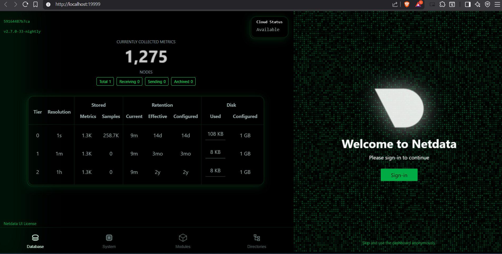

# System Monitoring with Netdata

This repository contains a simple setup to monitor system and application performance using **Netdata** via Docker.

---

## **Task 7: Monitor System Resources Using Netdata**

### **1. Run Netdata**

Use Docker to start Netdata container:

```bash
docker run -d --name=netdata -p 19999:19999 netdata/netdata
### **2. Access Dashboard**

Open your browser and go to:

http://localhost:19999


You will see live system metrics including:

- CPU usage per core  
- Memory (RAM and Swap)  
- Disk I/O  
- Docker container stats

### **3. Metrics Collected**

- CPU: Usage, system, user, idle, iowait  
- Memory: Total, used, cached, buffers, swap  
- Disk: Read/Write speeds  
- Docker containers: CPU, memory, network, disk


---

### **Step 4: Screenshot of Dashboard**

```markdown
## **Screenshot of Dashboard**



> Screenshot shows CPU, Memory, Disk, and Docker container metrics.

## **5. Notes**

- This setup provides **lightweight real-time monitoring**.  
- Using `docker-compose` allows **reproducible setup** for any team member.  
- Netdata is free and open-source.

